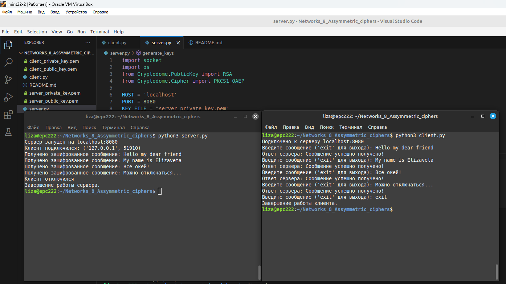

## Алгоритмы асимметричного шифрования

### Цель работы

Познакомиться с принципами работы протоколов рукопожатия в современных компьютерных системах

### Задания для выполнения

1. Реализовать протокол Диффи-Хеллмана в виде клиент-серверного приложения.
2. Реализовать клиент-серверную пару, которая шифрует сообщения асимметричным способом.

### Дополнительные задания

1. Модифицируйте код клиента и сервера так, чтобы приватный и публичный ключ хранились в текстовых файлах на диске и, таким образом, переиспользовались между запусками. 

### Результат:

#### Задания выполнены

<!-- Docs to Markdown version 1.0β17 -->
